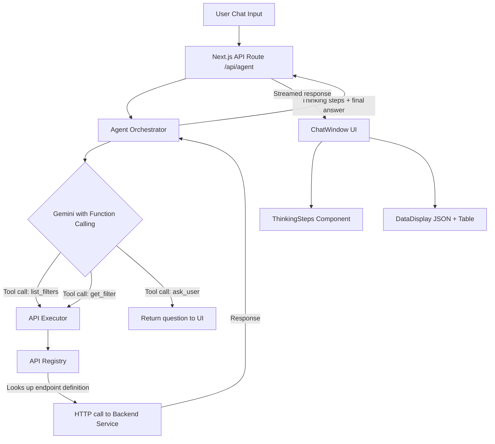

# Agentic Multi-Layer AI System for API Interaction

Build a scalable, plugin-style agentic system where Gemini acts as an AI orchestrator that reasons through user intent, selects the correct API(s), handles missing data, and displays its chain-of-thought process in real-time. The architecture must support growing from the initial Advanced Parameter Filter APIs to **250+ APIs** over time.

## User Review Required

> [!IMPORTANT]
> **Scalability-first design**: The entire system is built around a **declarative API Registry** pattern. Adding a new API is as simple as dropping a new JSON/TS definition into the registry folder — no changes to the orchestrator, UI, or Gemini prompt logic required.

> [!WARNING]
> **Backend proxy**: All calls to `localhost:30059` will be proxied through Next.js API routes to avoid CORS issues and keep secrets server-side. In production, the base URL should be configurable via environment variables.

> [!CAUTION]
> **Gemini function-calling**: We will use Gemini's native **function calling** capability rather than string-parsing. This is more reliable and the correct approach for an agentic system. This requires `@google/generative-ai` SDK which is already installed.

---

## Architecture Overview



---

## Proposed Changes

### Component 1: API Registry System

The registry is the foundation for scalability. Each API endpoint is described as a declarative definition that Gemini can understand and use via function calling.

#### [NEW] [registry.ts](file:///c:/Users/CM03844/Desktop/aimode/Comau/comau-lm/lib/agent/registry.ts)

Central registry module that:
- Defines the `ApiEndpoint` TypeScript interface (name, description, method, path, pathParams, queryParams, bodySchema, responseDescription)
- Exports a registry map: `Record<string, ApiEndpoint>`
- Provides a `getToolDeclarations()` function that converts all registered endpoints into Gemini-compatible function declarations
- Provides a `getEndpoint(name: string)` lookup function

```typescript
// Example shape of a registered endpoint
interface ApiEndpoint {
  name: string;                    // "list_adv_param_filters"
  description: string;             // "Lists all advanced parameter filter configurations"
  method: "GET" | "POST" | "PUT" | "DELETE";
  path: string;                    // "/advparamfilter"
  baseUrl: string;                 // from env, e.g. "http://localhost:30059/api/v1"
  pathParams?: ParamDef[];         // [{ name: "id", type: "integer", required: true, description: "..." }]
  queryParams?: ParamDef[];
  bodySchema?: object;             // JSON Schema for POST/PUT bodies
  responseDescription: string;     // Human-readable description of the response shape
  tags: string[];                  // ["advanced-parameter-filter", "reports"]
}
```

#### [NEW] [endpoints/advParamFilter.ts](file:///c:/Users/CM03844/Desktop/aimode/Comau/comau-lm/lib/agent/endpoints/advParamFilter.ts)

Registers the 4 Advanced Parameter Filter endpoints provided in the Swagger doc:
- `GET /advparamfilter` → `list_adv_param_filters`
- `GET /advparamfilter/{id}` → `get_adv_param_filter`
- `POST /advparamfilter` → `create_adv_param_filter`
- `DELETE /advparamfilter/{id}` → `delete_adv_param_filter` (implied from REST pattern)

Each definition includes full descriptions, parameter schemas, and response shapes so Gemini can reason about them.

#### [NEW] [endpoints/index.ts](file:///c:/Users/CM03844/Desktop/aimode/Comau/comau-lm/lib/agent/endpoints/index.ts)

Barrel file that imports and re-exports all endpoint definitions. **When adding 250+ APIs, developers simply create a new file in `endpoints/` and import it here** — zero changes to orchestrator or UI.

---

### Component 2: API Executor

#### [NEW] [executor.ts](file:///c:/Users/CM03844/Desktop/aimode/Comau/comau-lm/lib/agent/executor.ts)

Responsible for actually calling backend APIs:
- Takes an `ApiEndpoint` definition + resolved parameters from Gemini
- Substitutes path params, appends query params, sets body
- Makes the HTTP call using `fetch`
- Returns the response (or error) in a structured format
- Handles timeouts and error codes gracefully

---

### Component 3: Agent Orchestrator (Chain-of-Thought Engine)

#### [NEW] [orchestrator.ts](file:///c:/Users/CM03844/Desktop/aimode/Comau/comau-lm/lib/agent/orchestrator.ts)

Core agentic loop that:

1. **System prompt construction**: Builds a rich system prompt telling Gemini it is an API assistant for the Line Configuration Service. Includes general knowledge about what each API group does.

2. **Tool declarations**: Calls `registry.getToolDeclarations()` to pass all available APIs as Gemini function declarations, plus a special `ask_user` tool for requesting missing information.

3. **Multi-turn agentic loop**:
   ```
   while (not finished):
     1. Send messages + tools to Gemini
     2. If Gemini returns a function call:
        a. Log thinking step: "Calling {api_name} with {params}..."
        b. Execute via executor.ts
        c. Feed result back to Gemini as function response
        d. Continue loop
     3. If Gemini returns ask_user call:
        a. Return the question to the user, pausing the loop
     4. If Gemini returns a text response:
        a. This is the final answer — break
   ```

4. **Thinking steps accumulator**: Each iteration accumulates a `ThinkingStep` object:
   ```typescript
   interface ThinkingStep {
     id: number;
     type: "planning" | "api_call" | "analyzing" | "asking_user" | "complete";
     title: string;        // "Step 1: Understanding your request"
     detail: string;       // More detail
     status: "in_progress" | "done" | "waiting";
     data?: any;           // API response data, if applicable
   }
   ```

5. **Returns** a structured result:
   ```typescript
   interface AgentResult {
     thinkingSteps: ThinkingStep[];
     finalAnswer: string;           // Gemini's summarized response
     data?: any;                    // Structured data for table/JSON display
     dataFormat?: "table" | "json"; // How the UI should render data
     needsUserInput?: boolean;      // If ask_user was called
     question?: string;             // The question to ask the user
   }
   ```

---

### Component 4: New API Route

#### [NEW] [route.ts](file:///c:/Users/CM03844/Desktop/aimode/Comau/comau-lm/app/api/agent/route.ts)

New Next.js API route `/api/agent` that:
- Receives chat messages + conversation context
- Calls the orchestrator
- Returns a **streamed response** using `ReadableStream` that emits:
  - `{ type: "thinking_step", step: ThinkingStep }` — as each step happens
  - `{ type: "final_answer", answer: string, data?: any, dataFormat?: string }` — at the end
  - `{ type: "ask_user", question: string }` — when info is missing
- Uses Server-Sent Events (SSE) or newline-delimited JSON for streaming

#### [MODIFY] [route.ts](file:///c:/Users/CM03844/Desktop/aimode/Comau/comau-lm/app/api/chat/route.ts)

No changes needed — the existing `/api/chat` route continues to serve general-purpose Gemini chat. The new `/api/agent` route handles agentic API interactions.

---

### Component 5: Frontend — Thinking Steps UI

#### [NEW] [ThinkingSteps.tsx](file:///c:/Users/CM03844/Desktop/aimode/Comau/comau-lm/components/chat/ThinkingSteps.tsx)

A collapsible, animated component that displays the chain-of-thought:
- Shows each step with an icon, title, and expanding detail
- Steps animate in sequentially (slide-in + fade)
- Step types have distinct icons:
  - 🧠 Planning → brain icon
  - 🔌 API Call → plug/network icon
  - 🔍 Analyzing → magnifying glass
  - ❓ Asking User → question mark
  - ✅ Complete → checkmark
- Steps show status: spinner (in_progress), checkmark (done), or hourglass (waiting)
- Entire thinking section is collapsible after completion
- Uses smooth CSS animations (no extra libraries)

#### [NEW] [DataDisplay.tsx](file:///c:/Users/CM03844/Desktop/aimode/Comau/comau-lm/components/chat/DataDisplay.tsx)

Component for rendering API data in dual format:
- **Tab switcher**: JSON | Table (with a toggle pill)
- **JSON view**: Syntax-highlighted JSON using the existing [CodeBlock.tsx](file:///c:/Users/CM03844/Desktop/aimode/Comau/comau-lm/components/chat/CodeBlock.tsx)
- **Table view**: Auto-generated table from the data array with sortable columns
- Handles nested objects by flattening or showing expandable rows
- Responsive design for mobile

---

### Component 6: Frontend — Chat Integration

#### [MODIFY] [ChatWindow.tsx](file:///c:/Users/CM03844/Desktop/aimode/Comau/comau-lm/components/ChatWindow.tsx)

Update [handleSend](file:///c:/Users/CM03844/Desktop/aimode/Comau/comau-lm/components/ChatWindow.tsx#62-134) to:
1. Detect if the message is an API/agent-related query (using a simple keyword check OR always route through the agent)
2. Call `/api/agent` instead of `/api/chat` for agentic queries
3. Parse the streamed response and update state incrementally:
   - Add thinking steps to the current message as they arrive
   - Display the final answer when complete
   - If `ask_user` is received, display the question and wait for input

Update the [Message](file:///c:/Users/CM03844/Desktop/aimode/Comau/comau-lm/lib/chatService.ts#18-27) type or create an extended type:
```typescript
interface AgentMessage extends Message {
  thinkingSteps?: ThinkingStep[];
  data?: any;
  dataFormat?: "table" | "json";
}
```

#### [MODIFY] [MessageList.tsx](file:///c:/Users/CM03844/Desktop/aimode/Comau/comau-lm/components/chat/MessageList.tsx)

Update to:
- Check if a model message has `thinkingSteps` — if so, render `<ThinkingSteps>` above the final text
- Check if a model message has `data` — if so, render `<DataDisplay>` after the text
- Handle the "asking user" state with a styled prompt

#### [MODIFY] [chatService.ts](file:///c:/Users/CM03844/Desktop/aimode/Comau/comau-lm/lib/chatService.ts)

Minor update: Extend the [Message](file:///c:/Users/CM03844/Desktop/aimode/Comau/comau-lm/lib/chatService.ts#18-27) type to optionally include `thinkingSteps`, `data`, and `dataFormat` fields so they can be persisted in Firestore.

---

### Component 7: Environment Configuration

#### [MODIFY] [.env.local](file:///c:/Users/CM03844/Desktop/aimode/Comau/comau-lm/.env.local)

Add:
```
# Line Configuration Service
LINE_CONFIG_API_BASE_URL=http://localhost:30059/api/v1
```

---

## File Summary

| File | Action | Purpose |
|------|--------|---------|
| `lib/agent/registry.ts` | NEW | API registry system with TypeScript interfaces |
| `lib/agent/endpoints/advParamFilter.ts` | NEW | Advanced Parameter Filter endpoint definitions |
| `lib/agent/endpoints/index.ts` | NEW | Barrel file for all endpoint registrations |
| `lib/agent/executor.ts` | NEW | HTTP executor for backend API calls |
| `lib/agent/orchestrator.ts` | NEW | Core agentic loop with Gemini function calling |
| `app/api/agent/route.ts` | NEW | SSE-streamed API route for the agent |
| `components/chat/ThinkingSteps.tsx` | NEW | Animated chain-of-thought display |
| `components/chat/DataDisplay.tsx` | NEW | JSON + Table dual-view data component |
| [components/ChatWindow.tsx](file:///c:/Users/CM03844/Desktop/aimode/Comau/comau-lm/components/ChatWindow.tsx) | MODIFY | Route agentic queries to `/api/agent`, handle streaming |
| [components/chat/MessageList.tsx](file:///c:/Users/CM03844/Desktop/aimode/Comau/comau-lm/components/chat/MessageList.tsx) | MODIFY | Render thinking steps and data displays |
| [lib/chatService.ts](file:///c:/Users/CM03844/Desktop/aimode/Comau/comau-lm/lib/chatService.ts) | MODIFY | Extend Message type for agent fields |
| [.env.local](file:///c:/Users/CM03844/Desktop/aimode/Comau/comau-lm/.env.local) | MODIFY | Add backend service base URL |

---

## How to Add New APIs in the Future

To add any of the remaining 250+ APIs:

1. **Create a new file** in `lib/agent/endpoints/`, e.g., `stationConfig.ts`
2. **Define the endpoints** using the `ApiEndpoint` interface
3. **Import it** in `endpoints/index.ts`
4. **Done** — the orchestrator and UI automatically pick up the new APIs

No changes to `orchestrator.ts`, `executor.ts`, `ThinkingSteps.tsx`, or any other file. The registry pattern ensures **O(1) effort per new API group**.

---

## Verification Plan

### Automated Tests

Since this is a Next.js frontend project without an existing test framework, we will verify through browser-based testing:

1. **Build check**: Run `npm run build` in `c:\Users\CM03844\Desktop\aimode\Comau\comau-lm` to ensure no TypeScript or build errors
2. **Dev server**: Run `npm run dev` and confirm the app loads without console errors

### Manual Verification via Browser

After implementation, test the following scenarios in the browser at `http://localhost:3000`:

1. **General query**: Type "What is an Advanced Parameter Filter?" → AI should describe it using its knowledge, showing thinking steps (Planning → Responding)
2. **List all filters**: Type "Show me all filters" → AI should:
   - Show thinking steps (Planning → Calling API → Analyzing)
   - Call `GET /advparamfilter` 
   - Display results in both JSON and Table format with a summary
3. **Get specific filter**: Type "Get filter with ID 23" → AI should call `GET /advparamfilter/23` and display the result
4. **Missing ID scenario**: Type "Get me the details of a filter" (no ID) → AI should ask the user for the ID
5. **ID discovery**: If user says "I don't know the ID", AI should list all filters and ask user to pick one
6. **Streaming display**: Verify thinking steps appear one-by-one with animations, not all at once

> [!TIP]
> For the initial demo, ensure `http://localhost:30059/api/v1/advparamfilter` is reachable. If the backend isn't running, the system should handle errors gracefully and inform the user.
